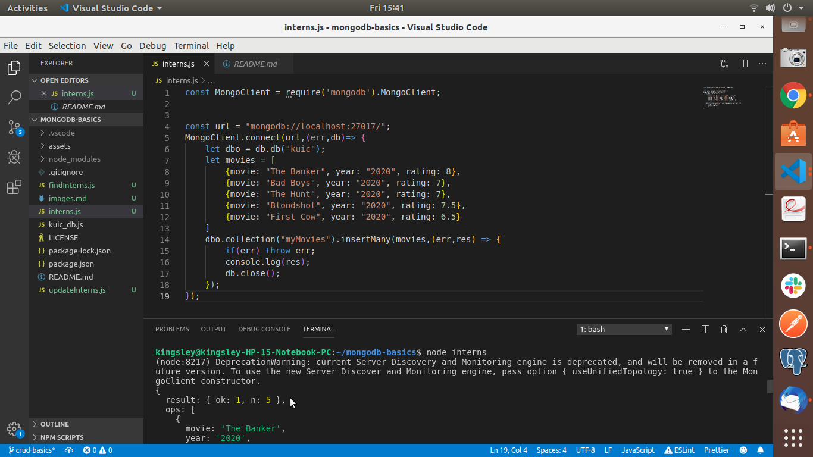

# Mongo-crud-basics
Mongodb Crud basics
# myMovies Collection Created

# Insert documents into myMovies Collection

# Find first document in collection

# Find movies with rating of 7

# Find movies title using projection

# Update movie : The Banker
